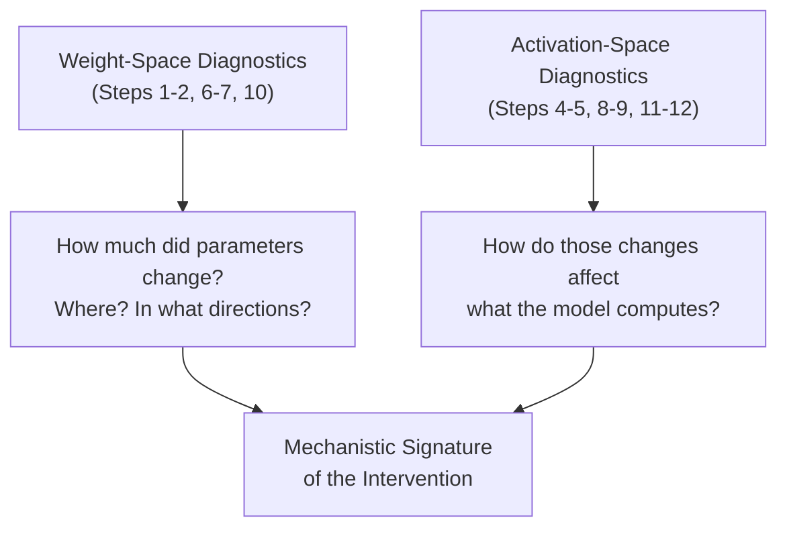

# What Makes Unlearning Brittle? A Mechanistic Study of Parameter-Space Interventions

This repository contains a diagnostic pipeline for creating unlearned large language models using various unlearning algorihtms, and then analyzing how these methods alter models in both parameter and activation spaces. The goal is to identify mechanistic signatures that distinguish deep representational change from shallow parameter patching.

## Quick Start

Add `HF_TOKEN` to `.env`

```bash
./pipeline.sh
```

---

## EXPERIMENT

### The Experimental Setup

The pipeline performs a **controlled experiment** with three models sharing identical architecture:

| Model | Role | What happened to it |
|---|---|---|
| `deep-ignorance-unfiltered` | **Base** (control) | Trained on everything, including WMDP-Bio hazardous content |
| `deep-ignorance-e2e-strong-filter` | **Filtered** (gold standard) | Trained from scratch with hazardous data *removed before training* |
| `deep-ignorance-unfiltered-cb-lat` | **Unlearned** (intervention) | Same as Base, but post-hoc unlearned via Circuit Breakers + LAT |

Every diagnostic runs **twice** — once for each comparison — always using the Base model as the reference:

```
Comparison 1:  Base → Filtered     (What does genuine ignorance look like?)
Comparison 2:  Base → Unlearned    (What does post-hoc unlearning look like?)
```

By contrasting these two comparisons, you can distinguish *deep representational change* (filtering) from *shallow parameter patching* (unlearning).

---

### The Two Datasets

**Step 3** creates two text datasets that serve as *probes* for the activation-level analyses:

| Dataset | Source | Purpose |
|---|---|---|
| `forget.txt` | WMDP-Bio questions | Text the model *should* have forgotten — the "target" of unlearning |
| `retain.txt` | WikiText-2 | Benign text the model *should* still handle well — the "control" |

These are analogous to stimulus and control conditions in an experiment. Every activation-level diagnostic (Steps 8–12) runs on *both* datasets, measuring whether interventions selectively affect forget-domain processing while preserving retain-domain processing.

---

### The Diagnostics: What and Why

The 12 steps form a hierarchy from **coarse to fine**, and from **weight-space to activation-space**:



---

#### Weight-Space Diagnostics

These examine `ΔW = W_modified − W_base` directly — treating the intervention as a matrix perturbation.

#### Steps 1–2: Parameter Statistics (`collect_param_stats.py` + `plot_param_stats.py`)

**Question:** *How large is the intervention, and where is it concentrated?*

For every weight matrix `W` in the model, this computes:

| Metric | Formula | What it tells you |
|---|---|---|
| **Frobenius norm** of ΔW | ‖ΔW‖_F = √(Σᵢⱼ ΔWᵢⱼ²) | Total magnitude of change — how much did this matrix move? |
| **Stable rank** of ΔW | ‖ΔW‖²_F / ‖ΔW‖²₂ | Effective dimensionality of the update. A rank-1 perturbation (e.g., LoRA-style) gives stable rank ≈ 1. A full-rank rewrite gives stable rank ≈ min(m,n). |
| **Stable rank** of W | Same, on original | Baseline dimensionality for comparison |
| **Empirical rank** (opt-in: `--empirical-rank`) | min k s.t. Σᵢᵏ σᵢ² ≥ 0.99·Σ σᵢ² | Discrete count of dimensions capturing 99% of variance (requires full SVD, slow) |

These are aggregated per layer and split into **MLP vs Attention** groups, then plotted.

**Why this matters:** If unlearning produces low-rank, localized updates (small ‖ΔW‖_F concentrated in a few layers) while filtering produces high-rank, distributed updates, that's direct evidence that unlearning is a *shallow patch* rather than a *deep restructuring*. The stable rank quantifies this precisely — it's the "soft" version of matrix rank, robust to noise.

---

##### Step 6: MLP vs Attention Breakdown (`analyze_mlp_vs_attn.py`)

**Question:** *Are the changes concentrated in MLP (knowledge storage) or Attention (routing/composition)?*

Takes the per-matrix stats from Step 1 and computes the ratio of MLP change to Attention change at each layer. Addresses the mechanistic hypothesis that knowledge is primarily stored in MLP layers (the "key-value memory" view from [Geva et al](https://arxiv.org/pdf/2012.14913).), while attention layers handle routing.

**Why this matters:** If unlearning only modifies attention layers, it might be redirecting *routing around* the knowledge rather than erasing it — explaining why adversarial fine-tuning can recover the information.

---

##### Step 7: Null Space & Subspace Analysis (`null_space_analysis.py`)

**Question:** *Is the update low-rank, and do the principal subspaces shift?*

For 50 sampled weight matrices, computes full SVD and measures:

| Metric | What it tells you |
|---|---|
| **Top-10 SV variance ratio** | What fraction of ΔW's energy is in its top 10 singular directions? High → very low-rank update. |
| **Effective rank** | How many singular values needed to capture 99% of variance |
| **Subspace alignment** (Grassmann distance) | Do the top-k singular vectors of W_base and W_modified span similar subspaces? High alignment → the intervention didn't change *what directions* the matrix uses, only *how much* it uses them. |

**Why this matters:** A low-rank ΔW with high subspace alignment means the unlearning intervention is a small perturbation within the existing computational manifold — it didn't rewire the representations, it just nudged the gains. This is precisely the geometric signature of brittleness: a small counter-perturbation (fine-tuning) can undo it.

---

##### Step 10: MLP Nullspace Alignment (`mlp_nullspace_alignment.py`)

**Question:** *Does ΔW lie in the nullspace of the original W?*

Decomposes each MLP update ΔW into components that lie in the **column space** vs. **null space** of the original weight matrix W.

- **Nullspace component** ("off-manifold"): Changes orthogonal to what W originally computed. These add new directions without disrupting existing computations.
- **Column space component** ("on-manifold"): Changes that directly interfere with existing computations.

**Why this matters:** If unlearning updates are primarily in the nullspace, the model's existing computations are barely disturbed — the "unlearned" knowledge may still flow through the same channels, just with a small additive correction that's easy to remove. True knowledge erasure should require on-manifold changes that destroy the original computation.

---

#### Activation-Space Diagnostics

These run the model on actual text and measure *what it computes*, not just what its parameters look like. All activation scripts cap input at `--max-samples 500` texts per split by default to keep runtimes manageable (override with e.g. `--max-samples 1000` for more statistical power).

#### Steps 4–5: Activation Norms (`collect_activation_norms.py` + `plot_activation_norms.py`)

**Question:** *Does the intervention globally suppress or amplify activations?*

For each layer, computes the mean L1 and L2 norms of hidden states, plus the norm of the *difference* in activations (‖h_modified − h_base‖). Run on both forget and retain texts.

**Why this matters:** If norms are similar between base and unlearned models but different for the filtered model, it means unlearning doesn't achieve suppression through reducing activation magnitudes — it's doing something more subtle (or less effective). This rules out the "global suppression" hypothesis.

---

##### Step 8: Activation Separation (`activation_separation_analysis.py`)

**Question:** *Can you tell forget-text activations apart from retain-text activations? Does the intervention change this?*

At each layer, extracts the centroid of forget-text activations and retain-text activations, then measures their separation via:

| Metric | What it captures |
|---|---|
| **Cosine distance** between centroids | Direction-based separation |
| **AUC** (linear classifier) | How linearly separable are the two distributions? |
| **Variance ratio** | Between-class vs. within-class variance (like Fisher's discriminant) |

**Why this matters:** If unlearning *increases* the separation between forget and retain activations (pushes them apart), that's evidence the model is actively routing forget-text to a different computational path. If separation stays similar, the model treats both text types the same way internally — it hasn't genuinely distinguished "knowledge to suppress."

---

##### Step 9: Activation Covariance Analysis (`activation_covariance_analysis.py`)

**Question:** *Does the intervention change the shape of the activation distribution?*

Computes the eigenvalue spectrum of the activation covariance matrix at each layer and measures:

| Metric | What it captures |
|---|---|
| **Effective rank** (of covariance) | How many dimensions do activations meaningfully occupy? |
| **Spectral entropy** | How uniform is the energy distribution across dimensions? |
| **Wasserstein distance** | How much did the spectrum change between base and modified model? |

A key output is the **selectivity ratio**: (Wasserstein distance on forget text) / (Wasserstein distance on retain text). High selectivity = the intervention specifically reshapes forget-domain representations while leaving retain-domain representations intact.

**Why this matters:** This captures something the norms miss — two distributions can have identical norms but completely different *shapes*. If filtering fundamentally restructures the covariance (high Wasserstein, changed effective rank) while unlearning barely disturbs it, that's evidence the representations aren't actually changing.

---

##### Step 11: Row Space Projection (`row_space_projection_analysis.py`)

**Question:** *Do activations from forget-text align more with the directions the intervention modified?*

Computes the SVD of ΔW at each MLP layer and measures how much the *input activations* project onto the row space (input-side principal directions) of ΔW.

If forget-text activations have high projection onto ΔW's row space while retain-text activations don't, the update is *precisely targeted* — it modifies exactly the directions that forget-text activates. The **selectivity ratio** quantifies this.

**Why this matters:** This is perhaps the most mechanistically informative diagnostic. It directly tests whether the intervention is *geometrically aligned* with the specific input patterns it needs to suppress. High selectivity + low rank = a surgical intervention that only fires on forget-domain inputs. Low selectivity = a blunt instrument that affects everything equally. And crucially, high selectivity + low rank is also the easiest to undo: just learn a small correction in that same low-dimensional subspace.

---

##### Step 12: Local Lipschitz Analysis (`local_lipschitzness_analysis.py`)

**Question:** *Did the intervention make the model's output more or less sensitive to input perturbations?*

Estimates the local Lipschitz constant by perturbing input embeddings with small noise (ε-balls) and measuring how much the output changes. Also computes gradient norms and output variance under perturbation, separately for forget and retain texts.

| Outcome | Interpretation |
|---|---|
| Forget text becomes **rougher** (higher Lipschitz) | Model is unstable on forget inputs — outputs shift erratically |
| Forget text becomes **smoother** (lower Lipschitz) | Model learned to ignore/suppress forget-domain features |
| Retain text stays **similar** | Intervention didn't damage general capabilities |

**Why this matters:** A model that becomes rougher on forget text hasn't *learned to not know* something — it's in an unstable regime where small pushes (fine-tuning) can tip it back. Smoothness changes are a direct indicator of whether the loss landscape around forget-domain inputs is fundamentally reshaped or just locally perturbed.

---

### The Big Picture

Reading left-to-right, the diagnostics answer an escalating series of questions:

| Level | Question | Steps |
|---|---|---|
| **Magnitude** | How much changed? | 1–2 |
| **Location** | Where — MLP or Attention? Which layers? | 6 |
| **Geometry** | What shape is ΔW? Low-rank? Nullspace-aligned? | 7, 10 |
| **Function** | Do activations actually change on target text? | 4–5, 8–9 |
| **Precision** | Is the change *targeted* at forget-domain inputs? | 11 |
| **Stability** | Is the new behavior robust or fragile? | 12 |

The thesis prediction is that unlearning methods (CB-LAT) will show: small magnitude, attention-localized, low-rank, nullspace-aligned, minimal activation change, low selectivity, and increased roughness — the full mechanistic signature of a brittle intervention. While filtering will show the opposite across every dimension.

---

### Output Structure

```
outputs/
  <comparison>/
    param_stats/          per_matrix.csv, per_layer.csv
    activation_stats/     activation_stats.csv
    mlp_attn_analysis/    summary + plots
    null_space_analysis/  null_space_results.csv + plots
    activation_separation/ separation metrics + plots
    activation_covariance/ covariance spectra + plots
    mlp_nullspace/        alignment metrics + plots
    row_space_projection/ projection metrics + plots
    lipschitzness/        Lipschitz estimates + plots

plots/
  <comparison>/
    param_plots/          Layer locality, stable rank, rank comparison
    activation_plots/     Activation norms, activation diffs
```

---

## UNLEARNING

Run unlearning experiments with **10 methods** via `run_unlearn.sh`, then feed the output into the diagnostic pipeline:

```bash
# Run unlearning
./run_unlearn.sh ga

# Analyze the result
uv run collect_param_stats.py \
  --model-a EleutherAI/deep-ignorance-unfiltered \
  --model-b outputs/EleutherAI_deep-ignorance-unfiltered__ga/unlearned_model \
  --outdir outputs/ga_analysis/param_stats
```

### Available Methods

| Method | Type | Description |
|---|---|---|
| `ga` / `ga_simple` | Loss | Gradient ascent on forget set |
| `grad_diff` | Loss | Weighted forget/retain NLL difference |
| `dpo` / `npo` / `simnpo` | Loss | Preference optimization variants |
| `rmu` | Representation | Steer hidden states toward random targets |
| `cb` | Representation | Cosine-similarity circuit rerouting |
| `lat` | Representation | Latent adversarial training for robustness |
| `cb_lat` | Representation | Circuit Breakers + LAT combined |

See `uv run unlearn.py --help` for full argument reference.

---

## Appendix A: CSV Column Reference

### `param_stats/per_matrix.csv`

One row per weight matrix in the model.

| Column | Description |
| :--- | :--- |
| `name` | Full parameter name (e.g., `gpt_neox.layers.10.mlp.dense_h_to_4h.weight`) |
| `layer` | Integer layer index extracted from name (`-1` if not layer-specific) |
| `group` | Coarse grouping: `attn` (attention) or `mlp` (feed-forward) |
| `shape0` | Matrix rows (output features) |
| `shape1` | Matrix columns (input features) |
| `dW_fro` | Frobenius norm of the weight difference: ‖ΔW‖_F |
| `dW_stable_rank` | Stable rank of ΔW: ‖ΔW‖²_F / ‖ΔW‖²₂ |
| `W_stable_rank` | Stable rank of the original (base) weights |
| `dW_empirical_rank`* | Number of singular values of ΔW capturing 99% of variance |
| `W_empirical_rank`* | Number of singular values of W capturing 99% of variance |

\* *Only present when `--empirical-rank` flag is passed (opt-in, requires full SVD).*

### `param_stats/per_layer.csv`

Aggregated statistics per (layer, group) pair.

| Column | Description |
| :--- | :--- |
| `layer` | Integer layer index |
| `group` | `attn` or `mlp` |
| `dW_fro_layer` | Root-sum-square of Frobenius norms in this group: √(Σ ‖ΔWᵢ‖²_F) |
| `mean_dW_stable_rank` | Mean stable rank of ΔW across matrices in this group |
| `mean_dW_empirical_rank`* | Mean empirical rank of ΔW across matrices in this group |
| `count_mats` | Number of weight matrices aggregated in this group |

\* *Only present when `--empirical-rank` flag is passed.*

### `activation_stats/activation_stats.csv`

One row per (layer, split) combination.

| Column | Description |
| :--- | :--- |
| `layer` | Layer index (0 to N) |
| `split` | Dataset split: `forget` or `retain` |
| `model_a_norm_L1` | Mean L1 norm of hidden states for model A (baseline): E[‖h‖₁] |
| `model_a_norm_L2` | Mean L2 norm of hidden states for model A (baseline): E[‖h‖₂] |
| `model_b_norm_L1` | Mean L1 norm of hidden states for model B (target) |
| `model_b_norm_L2` | Mean L2 norm of hidden states for model B (target) |
| `mean_dh_L1` | Mean L1 norm of the activation difference: E[‖Δh‖₁] |
| `mean_dh_L2` | Mean L2 norm of the activation difference: E[‖Δh‖₂] |
