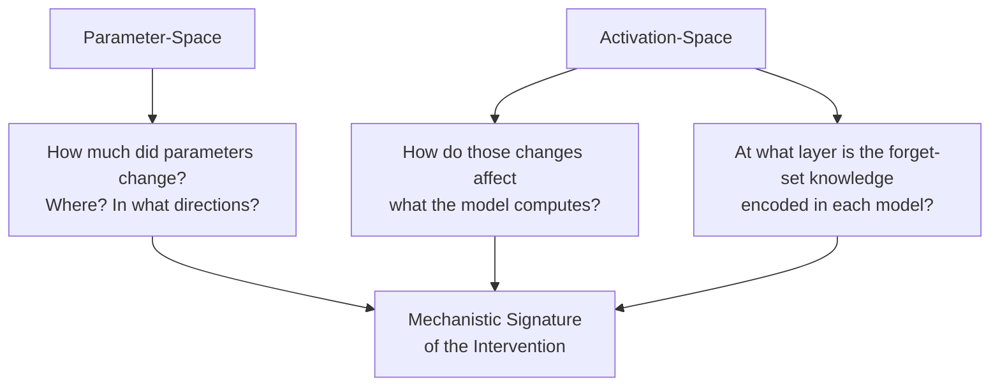

# What Makes Unlearning Brittle? A Mechanistic Study of Parameter-Space Interventions

This repository contains a pipeline for creating unlearned large language models using various unlearning algorihtms, and then analyzing how these methods alter models in both parameter and activation spaces. The goal is to identify mechanistic signatures that distinguish deep representational change from shallow parameter patching.

## Initial Proposal

The field of machine unlearning proposes a range of post-training interventions intended to remove sensitive or harmful information from large language models. However, these methods are brittle under further fine-tuning or adversarial tampering, and there is very limited mechanistic understanding of why unlearning approaches are so shallow. I would like to study unlearning methods through the lens of mechanistic interpretability, treating them as targeted parameter-space interventions whose internal effects can be directly analyzed. 

I analyze unlearning’s internal effects using various model-agnostic diagnostics that characterize how much models change, where those changes occur, and how high-dimensional they are, using layer-wise norms and effective rank, alongside activation-level diagnostics on “forget” and “retain” datasets. Initial results compare baseline, pretraining-filtered (demonstrating actual ignorance), and post-training unlearned models. This reveals distinct regimes: pretraining-time filtering induces large, high-rank, distributed updates consistent with deep representational change, while post-training methods such as Circuit Breaking with Latent Adversarial Training produce small, low-rank, attention-localized edits that leave feature computation largely intact. Activation norms appear to show that these differences are not explained by global suppression.

The project will expand across a broader set of unlearning algorithms (e.g., RMU, gradient-based, latent adversarial), and will also study how training dynamics—such as optimizer choice—shape the geometry of unlearning updates. Additional diagnostics may include representation-level analyses such as sparse autoencoders. By identifying mechanistic signatures associated with brittleness and partial robustness—such as update rank, depth, and distribution—this work aims to equip researchers with the information needed to design more effective approaches to tamper-resistant unlearning, rather than claiming success for existing methods.

---

## Quick Overview

We essentially have three workflows in this repository:

### Experiment

This is governed by `experiment/pipeline.sh`, which runs experiments on one or more models. We should ensure all experiments run via this file, with the general parameters already in place, following its outputs, etc.

We have steps, each of which corresponds to a file in the `experiment` folder.

See [Experimental Pipeline](#experimental-pipeline) for details.

### Unlearning

This is governed by `unlearn/run_unlearn.sh`, which creates a new unlearned model from scratch. We should similarly ensure all unlearning runs use this workflow. 

See [Unlearning](#unlearning) for available methods and tuning guidance.

### Inference

This is handled in the `infer/` folder with both command-line and web UI options. See [Inference](#inference) for usage examples.

## Style

Let's keep code clean, DRY, not littered with acronyms, clearly commented, etc. This is a learning resource for us as much as an experimental workflow. Prefer descriptive variable and function names (`dataset`, `example`, `question`) over abbreviations (`ds`, `ex`, `q`), for example.

## Testing

Please add tests for any new functionality. You can run all tests using:

`uv run tests/run_tests.py`

---

## Datasets

`uv run create_datasets.py` creates two text datasets that serve in training for unlearning, and as *probes* for activation-level analyses:

| Dataset | Source | Purpose |
|---|---|---|
| `forget.txt` | WMDP-Bio questions | Text the model *should* have forgotten — the "target" of unlearning |
| `retain.txt` | WikiText-2 | Benign text the model *should* still handle well — the "control" |

These are analogous to stimulus and control conditions in an experiment. Every activation-level diagnostic (Steps 3, 5–6, 8–9, 11–12) runs on *both* datasets, measuring whether interventions selectively affect forget-domain processing while preserving retain-domain processing.

---

## Pre-Requisites For Experimenting and Unlearning


- Add `HF_TOKEN`and `WANDB_API_KEY` to `.env`.
- Ensure the `uv` package manager is installed.

---

## Experiment

```bash
# Run pipeline for the default unlearned model (CB-LAT)
./experiment/pipeline.sh

# Run pipeline for a specific unlearned model
UNLEARNED=girishgupta/EleutherAI_deep-ignorance-unfiltered__ga ./experiment/pipeline.sh

# Include the pretraining-checkpoint comparison (COMP3)
ENABLE_PRETRAIN_COMPARISON=1 ./experiment/pipeline.sh

# Include the full CB-only chain (COMP4: Base→CB, COMP5: CB→Unlearned, COMP6: Unlearned→Filtered)
ENABLE_CB_COMPARISONS=1 ./experiment/pipeline.sh

# Enable everything
ENABLE_PRETRAIN_COMPARISON=1 ENABLE_CB_COMPARISONS=1 ./experiment/pipeline.sh
```

Already-completed steps are automatically skipped (pass `--force` to rerun).

---

### Experimental Pipeline

The pipeline performs experiments on three models sharing identical architecture.

| Model | Role | What happened to it |
|---|---|---|
| `deep-ignorance-unfiltered` | **Base** (control) | Trained on everything, including WMDP-Bio hazardous content |
| `deep-ignorance-e2e-strong-filter` | **Filtered** (gold standard) | Trained from scratch with hazardous data *removed before training* |
| `deep-ignorance-unfiltered-XXXXXX` | **Unlearned** (intervention) | Same as Base, but post-hoc unlearned |

By default, every diagnostic runs for two comparisons, always using the Base model as the reference:

```
Comparison 1:  Base → Filtered     (What does genuine ignorance look like?)   [always on]
Comparison 2:  Base → Unlearned    (What does post-hoc unlearning look like?) [always on]
```

By contrasting these two comparisons, you can distinguish *deep representational change* (filtering) from *shallow parameter patching* (unlearning).

Additional comparisons are **opt-in** to avoid unnecessary model loads on routine runs:

| Flag | Comparisons enabled | When to use |
|---|---|---|
| `ENABLE_PRETRAIN_COMPARISON=1` | COMP3: Base → Pretraining checkpoint | Studying training-stage effects |
| `ENABLE_CB_COMPARISONS=1` | COMP4: Base→CB-only, COMP5: CB-only→Unlearned, COMP6: Unlearned→Filtered | Studying the CB→CB-LAT ablation chain |

---

### Diagnostics



---

#### Step 0: MMLU Evaluation (`experiment/eval_mmlu.py`)

**Question:** *Does the model still have general capabilities?*

Runs MMLU (Massive Multitask Language Understanding) on each model before the expensive mechanistic diagnostics. This immediately identifies models that have catastrophically collapsed during unlearning (e.g., repeating degenerate tokens). Default 1000 questions sampled uniformly across all 57 MMLU subjects.

| Metric | What it tells you |
|---|---|
| **Overall accuracy** | Collapsed models score near random chance (0.25) or below |
| **Per-subject accuracy** | Reveals whether damage is uniform or domain-specific |

> **Note:** Results are stored **per-model** (not per-comparison) since MMLU evaluates a single model's capabilities.

---

#### Parameter-Space

These examine `W_modified`, `W_base`, and `ΔW = W_modified − W_base` directly—treating the intervention as a matrix perturbation.

#### Step 1: Parameter Statistics (`experiment/collect_weight_comparison.py`)

**Question:** *How large is the intervention, and where is it concentrated?*

For every weight matrix `W` in the model, this computes:

| Metric | Formula | What it tells you |
|---|---|---|
| **Relative Frobenius norm** of $\Delta W$ | $\frac{\lVert \Delta W \rVert_F}{\lVert W \rVert_F}$ | Normalized magnitude of change—what fraction of the original weight moved? Comparable across layers regardless of matrix size. |
| **Frobenius norm** of $\Delta W$ | $\lVert \Delta W \rVert_F = \sqrt{\sum_{ij} \Delta W_{ij}^2}$ | Raw total magnitude (unnormalized; also recorded for completeness) |
| **Spectral norm** of $\Delta W$ | $\frac{\sigma_1(\Delta W)}{\sigma_1(W)}$ | Relative worst-case amplification—how much did the dominant singular direction shift? High spectral + low stable rank = a sharp rank-1 spike. |
| **Stable rank** of $\Delta W$ | $\frac{\lVert \Delta W \rVert_F^2}{\lVert \Delta W \rVert_2^2}$ | Effective dimensionality of the update. A rank-1 perturbation (e.g., LoRA-style) gives stable rank $\approx 1$. A full-rank rewrite gives stable rank $\approx \min(m,n)$. |
| **Stable rank** of $W$ | $\frac{\lVert W \rVert_F^2}{\lVert W \rVert_2^2}$ | Baseline dimensionality for comparison |
| **Empirical rank** (opt-in: `--empirical-rank`) | $\min k$ s.t. $\sum_{i}^{k} \sigma_i^2 \geq 0.99 \cdot \sum \sigma_i^2$ | Discrete count of dimensions capturing 99% of variance (requires full SVD, so slow, so we default to not do this) |

These are aggregated per layer and split into **MLP vs Attention** groups, then plotted. The layer locality plot uses the **relative** Frobenius norm so layers are directly comparable; a separate spectral norm plot shows worst-case amplification per layer.

**Why this matters:** If unlearning produces low-rank, localized updates (small relative $\lVert \Delta W \rVert_F$ concentrated in a few layers) while filtering produces high-rank, distributed updates, that's direct evidence that unlearning is a *shallow patch* rather than a *deep restructuring*. The stable rank quantifies this precisely—it's the "soft" version of matrix rank, robust to noise.

---

#### Step 4: MLP vs Attention Breakdown (`experiment/analyze_mlp_vs_attn.py`)

**Question:** *Are the changes concentrated in MLP (knowledge storage) or Attention (routing/composition)?*

Takes the per-matrix stats from Step 1 and computes the ratio of MLP change to Attention change at each layer. Addresses the mechanistic hypothesis that knowledge is primarily stored in MLP layers (the "key-value memory" view from [Geva et al](https://arxiv.org/pdf/2012.14913).), while attention layers handle routing.

**Why this matters:** If unlearning only modifies attention layers, it might be redirecting *routing around* the knowledge rather than erasing it — explaining why adversarial fine-tuning can recover the information.

---

##### Step 7: Null Space & Subspace Analysis (`experiment/null_space_analysis.py`)

**Question:** *Is the update low-rank, and do the principal subspaces shift?*

For 50 sampled weight matrices, computes full SVD and measures:

| Metric | What it tells you |
|---|---|
| **Top-10 SV variance ratio** | What fraction of ΔW's energy is in its top 10 singular directions? High → very low-rank update. |
| **Effective rank** | How many singular values needed to capture 99% of variance |
| **Subspace alignment** (Grassmann distance) | Do the top-k singular vectors of W_base and W_modified span similar subspaces? High alignment → the intervention didn't change *what directions* the matrix uses, only *how much* it uses them. |

**Why this matters:** A low-rank ΔW with high subspace alignment means the unlearning intervention is a small perturbation within the existing computational manifold — it didn't rewire the representations, it just nudged the gains. This is precisely the geometric signature of brittleness: a small counter-perturbation (fine-tuning) can undo it.

---

##### Step 10: MLP Nullspace Alignment (`experiment/mlp_nullspace_alignment.py`)

**Question:** *Does ΔW lie in the nullspace of the original W?*

Decomposes each MLP update ΔW into components that lie in the **column space** vs. **null space** of the original weight matrix W.

- **Nullspace component** ("off-manifold"): Changes orthogonal to what W originally computed. These add new directions without disrupting existing computations.
- **Column space component** ("on-manifold"): Changes that directly interfere with existing computations.

**Why this matters:** If unlearning updates are primarily in the nullspace, the model's existing computations are barely disturbed — the "unlearned" knowledge may still flow through the same channels, just with a small additive correction that's easy to remove. True knowledge erasure should require on-manifold changes that destroy the original computation.

---

#### Activation-Space

These run the model on actual text and measure *what it computes*, not just what its parameters look like. All activation scripts cap input at `--max-samples 500` texts per split by default to keep runtimes manageable (override with e.g. `--max-samples 1000` for more statistical power).

##### Step 3: Activation Norms (`experiment/collect_activation_comparison.py`)

**Question:** *Does the intervention globally suppress or amplify activations?*

For each layer, computes the mean L1 and L2 norms of hidden states per token, plus the norm of the *difference* in activations ($\lVert h_{\text{modified}} - h_{\text{base}} \rVert$). Run on both forget and retain texts.

| Norm | Formula (per token) | What it captures |
|---|---|---|
| **L1** | $\sum_i \lvert h_i \rvert$ | Total activation mass—sensitive to diffuse, low-magnitude changes across many dimensions |
| **L2** | $\sqrt{\sum_i h_i^2}$ | Activation magnitude—sensitive to large spikes in individual dimensions |

Both are averaged across all tokens (weighted by attention mask). They are **not** divided by hidden dimension since all models share the same architecture, so they are directly comparable across models and layers.

**Why this matters:** If norms are similar between base and unlearned models but different for the filtered model, it means unlearning doesn't achieve suppression through reducing activation magnitudes—it's doing something more subtle (or less effective). L1 and L2 capture different aspects: L1 is more sensitive to many small changes spread across dimensions, while L2 is dominated by the largest components.

---

##### Step 8: Activation Separation (`experiment/activation_separation_analysis.py`)

**Question:** *Can you tell forget-text activations apart from retain-text activations? Does the intervention change this?*

At each layer, extracts the centroid of forget-text activations and retain-text activations, then measures their separation via:

| Metric | What it captures |
|---|---|
| **Cosine distance** between centroids | Direction-based separation |
| **AUC** (linear classifier) | How linearly separable are the two distributions? |
| **Variance ratio** | Between-class vs. within-class variance (like Fisher's discriminant) |

**Why this matters:** If unlearning *increases* the separation between forget and retain activations (pushes them apart), that's evidence the model is actively routing forget-text to a different computational path. If separation stays similar, the model treats both text types the same way internally — it hasn't genuinely distinguished "knowledge to suppress."

---

##### Step 9: Activation Covariance Analysis (`experiment/activation_covariance_analysis.py`)

**Question:** *Does the intervention change the shape of the activation distribution?*

Computes the eigenvalue spectrum of the activation covariance matrix at each layer and measures:

| Metric | What it captures |
|---|---|
| **Effective rank** (of covariance) | How many dimensions do activations meaningfully occupy? |
| **Spectral entropy** | How uniform is the energy distribution across dimensions? |
| **Wasserstein distance** | How much did the spectrum change between base and modified model? |

A key output is the **selectivity ratio**: (Wasserstein distance on forget text) / (Wasserstein distance on retain text). High selectivity = the intervention specifically reshapes forget-domain representations while leaving retain-domain representations intact.

**Why this matters:** This captures something the norms miss — two distributions can have identical norms but completely different *shapes*. If filtering fundamentally restructures the covariance (high Wasserstein, changed effective rank) while unlearning barely disturbs it, that's evidence the representations aren't actually changing.

---

##### Step 11: Row Space Projection (`experiment/row_space_projection_analysis.py`)

**Question:** *Do activations from forget-text align more with the directions the intervention modified?*

Computes the SVD of ΔW at each MLP layer and measures how much the *input activations* project onto the row space (input-side principal directions) of ΔW.

If forget-text activations have high projection onto ΔW's row space while retain-text activations don't, the update is *precisely targeted* — it modifies exactly the directions that forget-text activates. The **selectivity ratio** quantifies this.

**Why this matters:** This is perhaps the most mechanistically informative diagnostic. It directly tests whether the intervention is *geometrically aligned* with the specific input patterns it needs to suppress. High selectivity + low rank = a surgical intervention that only fires on forget-domain inputs. Low selectivity = a blunt instrument that affects everything equally. And crucially, high selectivity + low rank is also the easiest to undo: just learn a small correction in that same low-dimensional subspace.

---

##### Step 12: Local Lipschitz Analysis (`experiment/local_lipschitzness_analysis.py`)

**Question:** *Did the intervention make the model's output more or less sensitive to input perturbations?*

Estimates the local Lipschitz constant by perturbing input embeddings with small noise (ε-balls) and measuring how much the output changes. Also computes gradient norms and output variance under perturbation, separately for forget and retain texts.

| Outcome | Interpretation |
|---|---|
| Forget text becomes **rougher** (higher Lipschitz) | Model is unstable on forget inputs — outputs shift erratically |
| Forget text becomes **smoother** (lower Lipschitz) | Model learned to ignore/suppress forget-domain features |
| Retain text stays **similar** | Intervention didn't damage general capabilities |

**Why this matters:** A model that becomes rougher on forget text hasn't *learned to not know* something — it's in an unstable regime where small pushes (fine-tuning) can tip it back. Smoothness changes are a direct indicator of whether the loss landscape around forget-domain inputs is fundamentally reshaped or just locally perturbed.

---

##### Step 5: Linear Probe Analysis (`experiment/linear_probe_analysis.py`)

**Question:** *At which layer is the forget-set knowledge  linearly encoded?*

For each layer, this script extracts the **last-token hidden state** on both forget and retain texts, then trains a logistic regression "probe" to classify whether an activation came from forget or retain text.

| Metric | What it tells you |
|---|---|
| **Probe accuracy** | How well a linear classifier can distinguish forget from retain activations at this layer |
| **Selectivity** | Accuracy minus majority-class baseline — how much the probe exceeds random guessing. High selectivity = the layer linearly encodes the forget/retain distinction. |
| **AUC** (Area Under the ROC Curve) | How well the probe ranks forget vs retain samples, regardless of threshold. 0.5 = random, 1.0 = perfect separation. More robust than accuracy when class sizes are imbalanced. |

Default probe: `LogisticRegression(C=1.0, max_iter=1000)` — adjustable via `--C` and `--max-iter`.

**Why this matters:** This identifies *where* in the network the model stores information that distinguishes hazardous content from benign content. In a well-unlearned model, you'd expect low selectivity everywhere — the model genuinely can't tell the domains apart. In a poorly unlearned model, the probes will still find layers with high selectivity, meaning the knowledge is still encoded and a linear readout can recover it. Comparing probe profiles across BASE, FILTERED, and UNLEARNED reveals whether unlearning actually erased the representation or just hid it from the output head.

> **Note:** Unlike other steps, results are stored **per-model** (not per-comparison) since probes analyze a single model's representations.

---

##### Step 6: Layer-wise WMDP Accuracy (`experiment/layerwise_wmdp_accuracy.py`)

**Question:** *At which layer does the model "know" the answer to WMDP-Bio questions?*

Evaluates WMDP-Bio multiple-choice accuracy at every transformer layer using a **logit lens** (default) or **tuned lens**:

- **Logit lens:** Applies the model's own final LayerNorm + unembedding head (`lm_head`) to intermediate hidden states. Zero training cost.
- **Tuned lens:** Trains a per-layer affine transform (`nn.Linear`) mapping hidden states → vocab logits. More accurate at early layers but requires a training pass.

For each question, the lens computes log-probabilities of each answer choice at the target layer and picks the highest.

| Metric | What it tells you |
|---|---|
| **Accuracy** | Fraction of WMDP questions answered correctly using representations up to this layer |
| **Δ from final** | How much worse/better this layer is compared to reading from the model's final output |

**Why this matters:** A base model will show WMDP accuracy ramping up through mid-to-late layers — knowledge "crystallizes" as representations flow through the network. In a well-unlearned model, you'd expect accuracy to stay near chance (0.25 for 4-way MCQ) at *every* layer, not just the final one. If accuracy is high at intermediate layers but drops at the output, the knowledge is merely hidden, not erased — and a simple probe or fine-tuning attack could recover it.

> **Note:** Like Step 5, results are stored **per-model**.

---

### The Big Picture

The diagnostics answer an escalating series of questions:

| Level | Question | Steps |
|---|---|---|
| **Capabilities** | Does the model still work at all? | 0 |
| **Magnitude** | How much changed? | 1–2 |
| **Location** | Where — MLP or Attention? Which layers? | 4 |
| **Knowledge Localization** | Where is forget-set knowledge encoded? | 5 |
| **Knowledge Depth** | At which layer does the model know WMDP answers? | 6 |
| **Geometry** | What shape is ΔW? Low-rank? Nullspace-aligned? | 7, 10 |
| **Function** | Do activations actually change on target text? | 3, 8–9 |
| **Precision** | Is the change *targeted* at forget-domain inputs? | 11 |
| **Stability** | Is the new behavior robust or fragile? | 12 |

The thesis prediction is that unlearning methods (CB-LAT) will show: small magnitude, attention-localized, low-rank, nullspace-aligned, minimal activation change, low selectivity, and increased roughness — the full mechanistic signature of a brittle intervention. While filtering will show the opposite across every dimension.

---

### Output Structure

All results are saved under a single root (default `outputs/`):

```
outputs/
  <comparison>/                        # Steps 1–4, 7–12: per model-pair
    weight_comparison/     per_matrix.csv, per_component.csv, per_layer.csv, per_coarse_layer.csv
    param_plots/           Layer locality, stable rank, rank comparison PNGs
    activation_comparison/ activation_comparison.csv
    activation_plots/      Activation norms, activation diffs PNGs
    mlp_attn_analysis/     summary CSV + plots
    null_space_analysis/   null_space_results.csv + plots
    activation_separation/ separation metrics + plots
    activation_covariance/ covariance spectra + plots
    mlp_nullspace/         alignment metrics + plots
    row_space_projection/  projection metrics + plots
    lipschitzness/         Lipschitz estimates + plots

  <model>/                             # Steps 0, 5–6: per individual model
    evals/                 summary.json, high_level_summary.md
    linear_probes/         probe_results.csv, summary.json + plot
    wmdp_logit_lens/       wmdp_lens_results.csv, summary.json + plot
    wmdp_tuned_lens/       wmdp_lens_results.csv, summary.json + plot
```

> **Tip:** The pipeline automatically skips steps whose output already exists. Use `./experiment/pipeline.sh --force` to regenerate everything.

---

## Unlearning

```bash
# Run a comprehensive hyperparameter sweep across all methods (96 models evaluated)
# This uses NO_SAVE=1 by default so the 14GB+ checkpoints aren't saved to disk.
./unlearn/sweep_unlearn.sh

# Run the same sweep in parallel across multiple GPUs (see Multi-GPU below)
./unlearn/parallel_sweep.sh ./unlearn/sweep_unlearn.sh

# Create all 12 unlearned models with default hyperparameters
./unlearn/create_all_unlearning_models.sh

# Train a single method with defaults
./unlearn/run_unlearn.sh cb_lat
# -> unlearned_models/EleutherAI_deep-ignorance-unfiltered__cb_lat__ep1_lr1e-05_bs4_a100.0_sc20.0_le0.1_ls5_ly5-6-7/


# Override hyperparameters (automatically encoded into folder name)
EPOCHS=2 LR=5e-6 ./unlearn/run_unlearn.sh cb_lat
# -> unlearned_models/EleutherAI_deep-ignorance-unfiltered__cb_lat__ep2_lr5e-06_bs4_a100.0_sc20.0_le0.1_ls5_ly5-6-7/

# Push a finalised model to HuggingFace (skip re-running evals, just train and upload)
PUSH_TO_HUB=1 NO_EVAL=1 EPOCHS=3 LR=5e-05 BATCH_SIZE=8 RETAIN_WEIGHT=1.0 BETA=0.1 \
    ./unlearn/run_unlearn.sh npo
```

Output directories are auto-generated by `unlearn.py` based on the method and all its relevant hyperparameters, so different runs never overwrite each other. After training, eval benchmarks (MMLU, WikiText, WMDP variants) run automatically and results are logged to W&B. Add `--push-to-hub` (or `PUSH_TO_HUB=1` in the shell) to upload the finished model to HuggingFace. `sweep_unlearn.sh` runs with `NO_SAVE=1` by default to avoid filling the disk with checkpoints.

> [!TIP]
> **Idempotent Sweeps**: The shell scripts (`run_unlearn.sh`, `sweep_unlearn.sh`, `sweep_unlearn2.sh`) are fully idempotent. Before loading any models into GPU memory, they invoke `unlearn.py --check-wandb-only`. This queries the Weights & Biases API to see if a run with the exact matching hyperparameter `run_name` has already finished successfully. If it has, the script skips the training entirely and moves to the next configuration.

> [!NOTE]
> **Evaluation with `--no-save`**: When `--no-save` is specified, the model is still saved *temporarily* to disk so that `eval.py` can load it and run benchmarks. Once evaluation completes, the heavy weight files (`*.safetensors`, `*.bin`, etc.) are automatically deleted to save disk space, while the evaluation logs and configuration are preserved.

> [!NOTE]
> **Skipping evals with `--no-eval` / `NO_EVAL=1`**: When pushing a previously-evaluated model to HuggingFace, you can skip the full benchmark re-run with `NO_EVAL=1`. This is useful when you have already verified MMLU/WMDP metrics via W&B and just want to materialize the weights and upload:
> ```bash
> PUSH_TO_HUB=1 NO_EVAL=1 EPOCHS=3 LR=5e-05 BATCH_SIZE=8 RETAIN_WEIGHT=1.0 BETA=0.1 \
>     ./unlearn/run_unlearn.sh npo
> ```
> The `--no-eval` flag is independent of `--no-save` — you can use both at once (e.g., in sweeps) or just `--no-eval` alone when you want to keep the weights after training.

> [!NOTE]
> **Multi-GPU Parallel Sweeps (`parallel_sweep.sh`)**: Wrap any sweep script with `parallel_sweep.sh` to fan its iterations out across GPU groups automatically — no changes to the sweep scripts needed:
> ```bash
> ./unlearn/parallel_sweep.sh ./unlearn/sweep_unlearn4.sh
>
> # Override group size to skip the probe (useful if probe can't reach HuggingFace Hub)
> GPUS_PER_JOB=2 ./unlearn/parallel_sweep.sh ./unlearn/sweep_unlearn4.sh
> ```
> The wrapper:
> 1. **Loads `.env`** — sources the project `.env` file so `WANDB_API_KEY`, `HF_TOKEN`, etc. are available to all background job subprocesses (not just the Python scripts that call `load_dotenv()`).
> 2. **Probes VRAM** (config-based, fast) — downloads only the model's `config.json` (a few KB), estimates parameter count from architecture fields, and divides training VRAM (params + gradients + Adam states ≈ **4.5× model size**) by per-GPU VRAM from `nvidia-smi`. No model weights are downloaded.
> 3. **Picks group size** — the smallest power-of-two group (1/2/4/8) that fits the training footprint and divides evenly into the total GPU count. If the probe fails, defaults to **1 GPU per job** (maximum parallelism; override with `GPUS_PER_JOB=N` if you hit OOM).
> 4. **Swaps in a shim** — temporarily replaces `run_unlearn.sh` with a lightweight dispatcher that assigns each sweep config to a free GPU group and returns immediately, so the sweep loop queues the next config without waiting.
> 5. **Waits for all jobs**, then restores the original `run_unlearn.sh`.
>
> Example: 8× A40s (48 GB each), model needs 2 GPUs for training → **4 configs run simultaneously**, quartering total wall-clock time.
> Example: 4× B200s (180 GB each), model fits on 1 GPU → **4 configs run simultaneously**.
>
> `device_map="auto"` (the default `--device auto`) is still used within each job so the model is automatically sharded across the GPUs in that group.

### Evaluating Unlearned Models

After creating unlearned models (or when evaluating baseline base/filtered models directly), their evaluation metrics are logged to Weights & Biases if configured. You can analyze and rank the best unlearned models directly from W&B using:

```bash
# Fetch finished runs, rank them by WMDP/MMLU, and save as markdown
# Output is automatically written to: unlearn/analysis/best_unlearning_models.md
uv run unlearn/analysis/analyze_runs.py
```

> [!NOTE]
> If `analyze_runs.py` reports that no baseline metrics were found, it means the base models (`deep-ignorance-unfiltered` and `deep-ignorance-e2e-strong-filter`) need to be explicitly evaluated and pushed to W&B first:
>
> ```bash
> uv run experiment/eval.py --model EleutherAI/deep-ignorance-unfiltered \
>     --wandb-project cambridge_era --wandb-name EleutherAI/deep-ignorance-unfiltered
> ```

### Available Methods

| Method | Type | Key Params | Paper | Description |
|---|---|---|---|---|
| `ga_simple` | Loss | — | [Jang et al. 2023](https://arxiv.org/abs/2210.01504) | Pure gradient ascent: negates NLL on forget set to make the model *worse* at predicting those tokens. No retain term, so risks catastrophic forgetting of useful capabilities. |
| `ga` | Loss | `--retain-weight` | [Jang et al. 2023](https://arxiv.org/abs/2210.01504) | Gradient ascent on forget + gradient descent on retain. Simultaneously pushes UP forget-set loss and DOWN retain-set loss, balancing unlearning with capability preservation. |
| `grad_diff` | Loss | `--forget-weight` | | Like GA but with an explicit weight controlling the forget vs. retain trade-off. Higher `--forget-weight` unlearns more aggressively at the cost of retain quality. |
| `dpo` | Loss | `--beta` | [Rafailov et al. 2023](https://arxiv.org/abs/2305.18290) | Direct Preference Optimization repurposed for unlearning: treats retain data as "chosen" and forget data as "rejected". Requires a frozen reference model to prevent excessive drift. β controls update aggressiveness. |
| `npo` | Loss | `--beta`, `--retain-weight` | [Zhang et al. 2024](https://arxiv.org/abs/2404.05868) | Negative Preference Optimization: penalises the policy for assigning higher probability to forget data than the frozen reference model does, plus a retain NLL term. Only needs the forget set in the preference term. |
| `simnpo` | Loss | `--beta`, `--retain-weight` | [Meng et al. 2024](https://arxiv.org/abs/2405.14734) | Reference-free NPO: directly penalises the model's own log-probability on forget data instead of comparing to a reference. Cheaper (no ref model) but less stable. |
| `rmu` | Activation-Space | `--layer-id`, `--steering-coeff`, `--alpha` | [Li et al. 2024](https://arxiv.org/abs/2403.03218) | Representation Misdirection: at target layers, pushes forget-set hidden states toward a fixed random direction (MSE) so the model can't extract meaningful information, while anchoring retain-set activations to their original cached values. |
| `cb` | Activation-Space | `--layer-id`, `--steering-coeff`, `--alpha` | [Zou et al. 2024](https://arxiv.org/abs/2406.04313) | Circuit Breakers: like RMU but uses cosine similarity instead of MSE, making the loss invariant to activation magnitude — only the *direction* of representations matters. More robust to norm-scaling effects. |
| `lat` | Activation-Space | `--layer-id`, `--lat-eps`, `--lat-steps`, `--retain-weight` | [Casper et al. 2024](https://arxiv.org/abs/2403.05030) | Latent Adversarial Training: inner PGD loop finds a perturbation δ (injected at a hidden layer) that helps the model recall forget data; outer loop trains the model to unlearn even with δ active. Makes unlearning robust to representation-level attacks. |
| `cb_lat` | Activation-Space | `--layer-id`, `--steering-coeff`, `--alpha`, `--lat-eps`, `--lat-steps` | [Zou, et al. ](https://arxiv.org/abs/2406.04313) + [Casper](https://arxiv.org/abs/2403.05030) | Most robust method: combines CB's representation rerouting with LAT's adversarial robustness. Inner loop finds adversarial δ; outer loop applies Circuit Breaker rerouting with δ injected, forcing the model to reroute even under adversarial pressure. |
| `wt_dist` | Parameter-Space | `--wt-noise-std` | [Siddiqui et al. 2025](https://arxiv.org/abs/2505.22310) | Weight Distortion: adds Gaussian noise to ALL weights before training, then fine-tunes on retain data only. The noise destroys learned associations; retain fine-tuning recovers useful capabilities while forget knowledge stays degraded. |
| `wt_dist_reg` | Parameter-Space | `--wt-reg-lambda` | [Siddiqui et al. 2025](https://arxiv.org/abs/2505.22310) | Weight Distance Regularisation: minimises retain NLL while *maximising* L2 distance from pretrained weights. Directly optimises for tamper-resistance — the further weights move, the harder it is to recover the original model via fine-tuning. |

See `uv run unlearn/unlearn.py --help` for full argument reference.

> [!NOTE]
> **PEFT / LoRA compatibility.** The current script does **full-parameter** fine-tuning (all weights receive gradients). However, every method is compatible with LoRA in principle — the optimizer trains whatever parameters have `requires_grad=True`, and all loss functions operate on **activations/logits**, not weight matrices directly. To use LoRA, wrap the model with a PEFT adapter before the training loop; only the adapter weights will be updated. The adversarial inner loop in LAT/CB-LAT perturbs hidden states (not weights), so it is unaffected. Note: `wt_dist` and `wt_dist_reg` operate directly on weight space, so they are **not** compatible with LoRA adaptors — they require full-parameter access by design.

---

#### Algorithm Details

##### GA Simple — Pure Gradient Ascent

The simplest unlearning baseline. Maximizes the cross-entropy loss on the forget set, pushing the model to produce *worse* predictions on forget data. No retain-set regularization.

$$L = -\text{NLL}_{\text{forget}}$$

**Risk:** Without retain loss, the model can degrade globally (catastrophic forgetting of general capabilities).

##### GA — Gradient Ascent with Retain Regularization

Adds a standard NLL term on the retain set to stabilize the model while performing gradient ascent on the forget set.

$$L = -\text{NLL}_{\text{forget}} + \text{NLL}_{\text{retain}}$$

##### GradDiff — Gradient Difference

Similar to GA but explicitly weights the forget-ascent and retain-descent terms separately. The `--forget-weight` parameter controls the trade-off.

$$L = \text{NLL}_{\text{retain}} - w \cdot \text{NLL}_{\text{forget}}$$

When $w = 1$, this is equivalent to GA. Higher $w$ makes the model unlearn more aggressively at the cost of retain performance.

##### DPO — Direct Preference Optimization

Treats unlearning as a preference problem: retain texts are "chosen" (preferred) and forget texts are "rejected". Requires a frozen **reference model** (a copy of the original).

$$L = -\log \sigma\!\Big(\beta \cdot \big[\log \frac{\pi_\theta(y_w)}{\pi_{\text{ref}}(y_w)} - \log \frac{\pi_\theta(y_l)}{\pi_{\text{ref}}(y_l)}\big]\Big)$$

Where $y_w$ = retain (chosen), $y_l$ = forget (rejected), and $\beta$ is the inverse temperature.

##### NPO — Negative Preference Optimization

DPO-inspired but focuses the preference term only on the forget set. The model is penalized for assigning higher log-probability to forget data than the reference model does, plus a standard retain NLL term.

$$L = -\frac{2}{\beta} \cdot \mathbb{E}\!\big[\log \sigma\!\big(-\beta \cdot \log \frac{\pi_\theta}{\pi_{\text{ref}}}\big)\big]_{\text{forget}} + \text{NLL}_{\text{retain}}$$

##### SimNPO — Simple NPO (Reference-Free)

Removes the need for a reference model by directly penalizing the model's own log-probabilities on the forget set. Simpler and cheaper than NPO.

$$L = -\frac{2}{\beta} \cdot \mathbb{E}\!\big[\log \sigma\!\big(-\beta \cdot \text{avg\_logprob}_\theta\big)\big]_{\text{forget}} + \text{NLL}_{\text{retain}}$$

##### RMU — Representation Misdirection for Unlearning

Operates on **hidden-state activations** rather than output logits. At specified layers (`--layer-id`), it pushes forget-set activations toward a fixed random direction while anchoring retain-set activations to their original values (cached before training).

$$L = \sum_{\ell \in \text{layers}} \Big[ \text{MSE}\!\big(h_\ell^{\text{forget}},\; c \cdot \hat{r}_\ell\big) + \alpha \cdot \text{MSE}\!\big(h_\ell^{\text{retain}},\; h_\ell^{\text{cached}}\big) \Big]$$

Where $\hat{r}_\ell$ is a unit-norm random target per layer and $c$ is `--steering-coeff`.

##### CB — Circuit Breakers (Representation Rerouting)

Like RMU but uses **cosine similarity** instead of MSE. This makes the loss invariant to activation magnitude — it only cares about *direction*.

- **Forget:** Maximize cosine similarity between forget activations and the random target direction.
- **Retain:** Minimize `1 − cos(current, cached)` to keep retain activations directionally aligned with originals.

$$L = \sum_{\ell} \Big[ -\cos(h_\ell^{\text{forget}},\; c \cdot \hat{r}_\ell) + \alpha \cdot \big(1 - \cos(h_\ell^{\text{retain}},\; h_\ell^{\text{cached}})\big) \Big]$$

##### LAT — Latent Adversarial Training

Introduces a two-phase optimization to make unlearning robust to adversarial attacks:

1. **Inner loop** (adversary): Find a perturbation $\delta$ injected at the **middle target layer** that *minimizes* the forget-set NLL — i.e., helps the model recall forget data. Uses PGD (Projected Gradient Descent) for `--lat-steps` iterations, constrained to $\|\delta\|_\infty \leq$ `--lat-eps`. Gradients flow only into $\delta$, not the model.

2. **Outer loop** (defender): With $\delta$ frozen and injected, perform gradient ascent on forget NLL + gradient descent on retain NLL. This forces the model to unlearn **even under adversarial pressure**.

$$L_{\text{outer}} = -\text{NLL}_{\text{forget}}^{(\delta^*)} + \text{NLL}_{\text{retain}}$$

##### CB-LAT — Circuit Breakers + Latent Adversarial Training

The most robust method. Combines the adversarial robustness of LAT with the representation-level rerouting of CB:

1. **Inner loop (LAT):** Find adversarial $\delta$ at the middle target layer that helps the model recall forget data (same PGD procedure as LAT).

2. **Outer loop (CB):** With $\delta$ frozen and injected, compute the Circuit Breaker loss — rerouting forget-set activations toward random targets while preserving retain-set activations. The key difference from standalone CB is that the forget activations are collected **with the adversarial perturbation active**, so the model must reroute representations even when an adversary is trying to restore them.

$$L_{\text{outer}} = \sum_{\ell} \Big[ -\cos\!\big(h_\ell^{\text{forget}(\delta^*)},\; c \cdot \hat{r}_\ell\big) + \alpha \cdot \big(1 - \cos(h_\ell^{\text{retain}},\; h_\ell^{\text{cached}})\big) \Big]$$

##### Weight Distortion — Gaussian Noise + Retain Fine-Tuning

From [*From Dormant to Deleted*](https://arxiv.org/abs/2505.22310). Adds isotropic Gaussian noise (σ = `--wt-noise-std`, default 0.02) to **all** model weights before training, then fine-tunes on the retain set only. The noise displaces the model far from the pretrained basin in weight space, making it hard for an adversary to fine-tune back.

$$\theta_0 \leftarrow \theta_{\text{pretrained}} + \mathcal{N}(0, \sigma^2 I)$$
$$L = \text{NLL}_{\text{retain}}$$

##### Weight Distance Regularization — Maximize L2 from Pretrained

Also from [*From Dormant to Deleted*](https://arxiv.org/abs/2505.22310). Minimizes retain NLL while **explicitly maximizing** the L2 distance between the current and pretrained weights. This directly optimizes for tamper-resistance — the larger the distance, the harder it is to recover the original model via fine-tuning.

$$L = \text{NLL}_{\text{retain}} - \lambda \cdot \|\theta - \theta_{\text{pretrained}}\|_2^2$$

Where $\lambda$ is `--wt-reg-lambda` (default 0.1). The paper shows this produces the highest tamper-resistance of all methods tested, outperforming CB, RMU, SCRUB, and even CB-LAT under relearning attacks.

---

#### Hyperparameter Defaults & Tuning Guide

All methods use **full-parameter training** with AdamW + cosine annealing. Shared defaults:

| Setting | Default | Flag |
|---|---|---|
| Learning rate | 1e-5 | `--lr` |
| Epochs | 1 | `--epochs` |
| Batch size | 4 | `--batch-size` |
| Max sequence length | 512 | `--max-length` |
| Gradient clipping | 1.0 | `--grad-clip` |
| Gradient accumulation | 1 | `--grad-accum-steps` |
| Eval split | 10% | `--eval-split` |

##### Per-Method Defaults

| Method | Key Param | Default | What to tune if collapsing | What to tune if not unlearning enough |
|---|---|---|---|---|
| `ga` | `--retain-weight` | 1.0 | ↑ to 2–10 | ↓ below 1.0 |
| `grad_diff` | `--forget-weight` | 1.0 | ↓ to 0.1–0.5 | ↑ to 2–5 |
| `dpo` | `--beta` | 0.1 | ↓ beta (gentler updates) | ↑ beta (sharper preference) |
| `npo` | `--beta`, `--retain-weight` | 0.1, 1.0 | ↑ retain-weight or ↓ beta | ↑ beta or ↓ retain-weight |
| `simnpo` | `--beta`, `--retain-weight` | 0.1, 1.0 | ↑ retain-weight or ↓ beta | ↑ beta or ↓ retain-weight |
| `rmu` | `--alpha`, `--steering-coeff` | 100.0, 20.0 | ↑ alpha or ↓ steering-coeff | ↓ alpha or ↑ steering-coeff |
| `cb` | `--alpha`, `--steering-coeff` | 100.0, 20.0 | ↑ alpha or ↓ steering-coeff | ↓ alpha or ↑ steering-coeff |
| `lat` | `--lat-eps`, `--retain-weight` | 0.1, 1.0 | ↑ retain-weight or ↓ lat-eps | ↑ lat-eps or ↓ retain-weight |
| `cb_lat` | `--alpha`, `--lat-eps` | 100.0, 0.1 | ↑ alpha or ↓ lat-eps | ↓ alpha or ↑ lat-eps |
| `wt_dist` | `--wt-noise-std` | 0.02 | ↓ noise (less destruction) | ↑ noise (more disruption) |
| `wt_dist_reg` | `--wt-reg-lambda` | 0.1 | ↓ lambda (less weight push) | ↑ lambda (more distance) |

> [!TIP]
> **Preventing catastrophic collapse.** If MMLU drops well below the ~45% baseline, the two most effective levers are:
> 1. **Increase `--retain-weight`** (for ga/npo/simnpo/lat) or **`--alpha`** (for rmu/cb/cb_lat) — this strengthens the retain-preservation term relative to the forget-ascent term.
> 2. **Lower the learning rate** (`--lr 5e-6` or `1e-6`) — slower updates give the retain term more weight per step.
> 3. **More epochs with lower LR** — `EPOCHS=3 LR=5e-6` often works better than 1 epoch at 1e-5.
>
> The goal is MMLU within ~3% of the 45% baseline while still showing elevated forget-set NLL.

## Inference

Two inference options are available:

### Command Line Interface

```bash
# Single prompt inference (auto-picks the GPU with most free VRAM)
uv run infer/cli.py --model EleutherAI/deep-ignorance-unfiltered --prompt "What is biotin?"

# Pin to a specific GPU
uv run infer/cli.py --model EleutherAI/deep-ignorance-unfiltered --prompt "..." --device cuda:1

# Force a specific dtype or run on CPU
uv run infer/cli.py --model EleutherAI/deep-ignorance-unfiltered --prompt "..." --device cpu --dtype fp32
```

| Flag | Default | Description |
|---|---|---|
| `--max-tokens` | 200 | Maximum new tokens to generate |
| `--device` | `auto` | `auto` (best GPU), `cuda`, `cuda:N`, `mps`, `cpu` |
| `--dtype` | `auto` | `auto` (bf16 on CUDA, fp16 on MPS, fp32 on CPU), `fp32`, `fp16`, `bf16` |

With `--device auto` (the default), `device_map="auto"` is passed to HuggingFace so accelerate automatically places the model on the GPU with the most free memory — the same behaviour as `unlearn.py`.

### Streamlit Web UI

```bash
# Launch interactive web interface
uv run infer/run.py
```

---

## Appendix A: CSV Column Reference

### `weight_comparison/per_matrix.csv`

One row per weight matrix in the model.

| Column | Description |
| :--- | :--- |
| `name` | Full parameter name (e.g., `gpt_neox.layers.10.mlp.dense_h_to_4h.weight`) |
| `layer` | Integer layer index extracted from name (`-1` if not layer-specific) |
| `group` | Coarse grouping: `attn` (attention) or `mlp` (feed-forward) |
| `shape0` | Matrix rows (output features) |
| `shape1` | Matrix columns (input features) |
| `dW_fro` | Frobenius norm of the weight difference: $\lVert \Delta W \rVert_F$ |
| `W_fro` | Frobenius norm of the original (base) weight: $\lVert W \rVert_F$ |
| `dW_fro_rel` | Relative Frobenius norm: $\frac{\lVert \Delta W \rVert_F}{\lVert W \rVert_F}$ (fraction of original weight changed) |
| `dW_spectral` | Spectral norm (largest singular value) of $\Delta W$: $\sigma_1(\Delta W)$ |
| `W_spectral` | Spectral norm of the original (base) weight: $\sigma_1(W)$ |
| `dW_spectral_rel` | Relative spectral norm: $\frac{\sigma_1(\Delta W)}{\sigma_1(W)}$ |
| `dW_stable_rank` | Stable rank of $\Delta W$: $\frac{\lVert \Delta W \rVert_F^2}{\lVert \Delta W \rVert_2^2}$ |
| `W_stable_rank` | Stable rank of the original (base) weights |
| `dW_empirical_rank`* | Number of singular values of $\Delta W$ capturing 99% of variance |
| `W_empirical_rank`* | Number of singular values of W capturing 99% of variance |

\* *Only present when `--empirical-rank` flag is passed (opt-in, requires full SVD).*

### `weight_comparison/per_layer.csv`

Aggregated statistics per (layer, group) pair.

| Column | Description |
| :--- | :--- |
| `layer` | Integer layer index |
| `group` | `attn` or `mlp` |
| `dW_fro_layer` | Root-sum-square of Frobenius norms in this group: $\sqrt{\sum \lVert \Delta W_i \rVert_F^2}$ |
| `W_fro_layer` | Root-sum-square of original weight Frobenius norms: $\sqrt{\sum \lVert W_i \rVert_F^2}$ |
| `dW_fro_layer_rel` | Relative change: `dW_fro_layer / W_fro_layer` |
| `max_dW_spectral` | Max spectral norm of $\Delta W$ across matrices in this group |
| `max_W_spectral` | Max spectral norm of $W$ across matrices in this group |
| `max_dW_spectral_rel` | Relative spectral norm: `max_dW_spectral / max_W_spectral` |
| `mean_dW_stable_rank` | Mean stable rank of $\Delta W$ across matrices in this group |
| `mean_dW_empirical_rank`* | Mean empirical rank of $\Delta W$ across matrices in this group |
| `count_mats` | Number of weight matrices aggregated in this group |

\* *Only present when `--empirical-rank` flag is passed.*

### `activation_comparison/activation_comparison.csv`

One row per (layer, split) combination.

| Column | Description |
| :--- | :--- |
| `layer` | Layer index (0 to N) |
| `split` | Dataset split: `forget` or `retain` |
| `model_a_norm_L1` | Mean L1 norm of hidden states for model A (baseline): $\mathbb{E}[\lVert h \rVert_1]$ |
| `model_a_norm_L2` | Mean L2 norm of hidden states for model A (baseline): $\mathbb{E}[\lVert h \rVert_2]$ |
| `model_b_norm_L1` | Mean L1 norm of hidden states for model B (target) |
| `model_b_norm_L2` | Mean L2 norm of hidden states for model B (target) |
| `mean_dh_L1` | Mean L1 norm of the activation difference: $\mathbb{E}[\lVert \Delta h \rVert_1]$ |
| `mean_dh_L2` | Mean L2 norm of the activation difference: $\mathbb{E}[\lVert \Delta h \rVert_2]$ |
